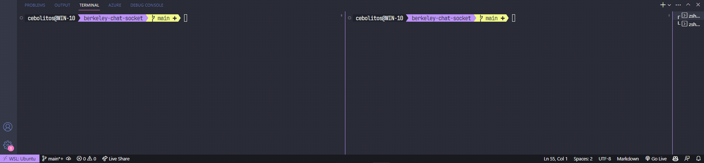

# Bidirecional Unix Chat



Esse projeto é um exemplo de um chat bidirecional utilizando sockets Unix. Socket Unix é um tipo de socket que utiliza um arquivo como endereço, ao invés de um endereço IP e uma porta. Esse tipo de socket é muito utilizado em sistemas operacionais baseados em Unix, como o Linux e o MacOS. Socket é uma forma de comunicação entre processos, que pode ser utilizada tanto em processos que estão na mesma máquina, quanto em processos que estão em máquinas diferentes.

## Como funciona

Nesse exemplo, há uma simulação de um chat entre dois usuários. O chat é bidirecional, ou seja, os dois usuários podem enviar mensagens um para o outro. Ambos os arquivos tanto `client` quanto `server` são executados em terminais diferentes, e a comunicação entre eles é feita através de um arquivo, que é criado pelo `server`, e esse mesmo arquivo é usado por `client`. O `client` escreve no arquivo, e o `server` lê o arquivo, e vice-versa.

A ordem de execução de ambos os processos é indiferente, ou seja, tanto o `client` quanto o `server` podem ser executados primeiro, e o chat funcionará normalmente.

## Como compilar

Para compilar os arquivos `client` e `server`, execute os comandos estando na pasta do projeto:

```bash
gcc client.c -o client
gcc server.c -o server
```

## Como executar

Para executar o `server`, execute o comando:

```bash
./server
```

Para executar o `client`, execute o comando:

```bash
./client
```

Ou se preferir, pode fazer tudo com apenas um comando:

```bash
gcc client.c -o client && ./client
```

Em outra instância do terminal, execute:

```bash
gcc server.c -o server && ./server
```

## Como utilizar

Após executar o `server` e o `client`, você pode digitar mensagens no `client` e pressionar `Enter` para enviá-las. As mensagens enviadas pelo `client` serão exibidas no `server`, e as mensagens enviadas pelo `server` serão exibidas no `client`.

Para sair do chat, pressione `Ctrl + C` no `client` ou no `server`. Isso irá encerrar a execução de ambos os processos.

## Desafios

Há alguns desafios que podem ser feitos para melhorar o projeto, o priemiro mais util, é impedir a sobreposição de mensagens na saída padrão, note que se uma mensagem é deixada no buffer de saída padrão, e outra mensagem é enviada, vai acontecer um embaralhamento das mensagens, prentendo fazer uso da biblioteca `ncurses` com threads.
